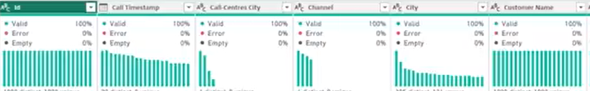
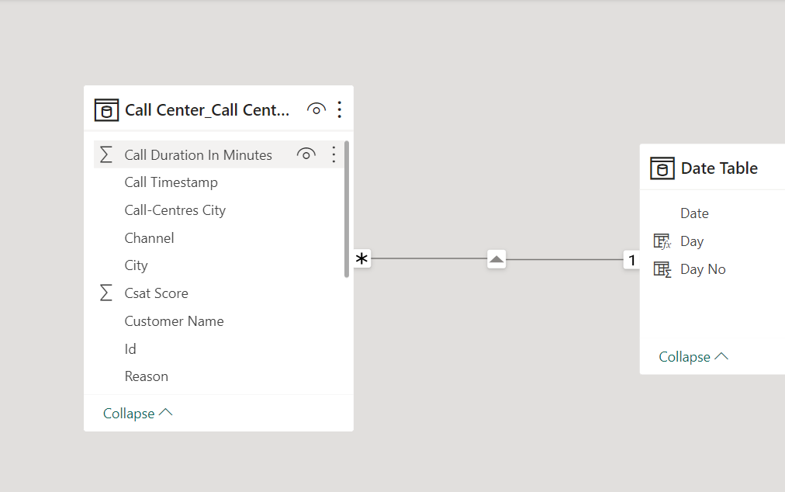
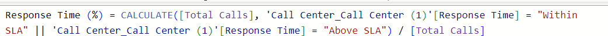
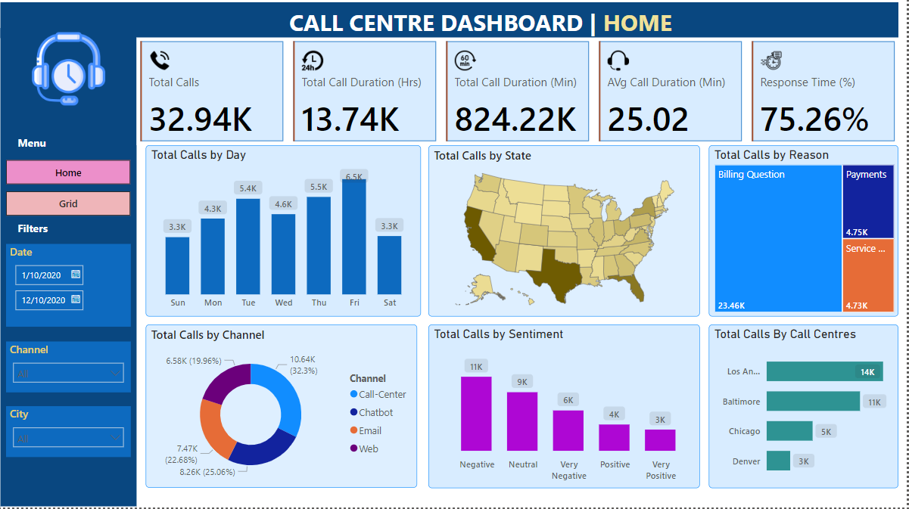

# Call Centre Analysis 

## Introduction 

I came across the dataset online and admired how rich the data is as I have been trying to get my hands dirty with a very rich dataset to practice my skills of data cleaning, analysis and visualization.

## Tools Used :

• Microsoft Excel and Power BI

## Power BI Concept applied

Connecting to SQL Server, Data Cleaning, Data Modelling, Data Processing, Power Query, Date Tables, Time Intelligence Function, DAX, Date Function, Custom Charts, Text Functions, Filter Function, Calculate, SUM/ SUMX, New Card Visual, Formatting Visuals, Creating Charts, Creating Functions and Navigations

## Problem Statements 

**Home Page:**

Total Number of calls
Total Call Duration In Hours: 
Total Call Duration In Minutes:
Average Call Duration In Minutes 
Response Time In Percentage 

**GRID**

Create a Grid view dashboard displaying a table of all call details in Power bi

## Data Transformation/Cleaning:

The data was checked, efficiently cleaned and transformed with the Power Query Editor of Power BI. Some of the applied steps included

**Data quality**

This helped to check for the data validity and quality which were found to be very good.

**Date Table**

A date table was created to answer the problem statement by day. Also, a new one was created for day and day no. The screenshots are shown below.

## Data Modelling 

I created a relationship between “Date” from the date table with “Call Timestamp” in the Call Centre table on a “One-Many” relationship 

## Measure 

To answer the problem statements the following Measures were created as shown below 

Total Number of Calls 

Total Call Durations In Minutes

Total call Durations in Hour

Average Call  In Minutes 

Response Time Percentage 

Certainly! Here are some insights based on the provided information:

**1. Call Volume and Duration:**

The total number of calls is 32.94K, indicating a significant call load.
Despite the high call volume, the total call duration is 13.74K hours, suggesting relatively short calls on average.
 
• The average call duration is 25.02 minutes, providing an understanding of the typical length of interactions.

**2. Response Time:**

• The 75.26% response time indicates relatively efficient handling of calls, with three-fourths of calls being responded to within a specified time frame.

**3. Call Distribution by Day:**

• Friday sees the highest number of calls, suggesting a peak in customer interactions on that day.
     
• Conversely, Saturday and Sunday show the lowest call volumes, possibly indicating reduced activity or support over the weekends.

**4. Channel Distribution:**

• The doughnut chart displaying total calls by channel highlights the Call Centre as the dominant communication channel, showcasing its effectiveness or popularity among users.

**5. Sentiment Analysis:**

• The bar chart for total calls by sentiment reveals that negative sentiment calls are predominant. This could signal potential areas for improvement in customer satisfaction or service quality.

**6. Geographical Call Distribution:**

• Los Angeles stands out as the centre with the highest call volume, emphasizing its significance in the service landscape.

• Denver, with the lowest call volume, may need attention or analysis to understand factors influencing lower interaction.

## Conclusion:

The data suggests a considerable call volume with notable patterns in day-wise distribution, channel preferences, sentiment trends, and regional variations. Addressing negative sentiments and understanding the reasons behind lower call volumes in specific regions are crucial for improving overall customer experience

## Recommendations:

Conduct a detailed analysis of calls on Fridays to understand the specific nature of inquiries and optimize resources accordingly.

• Investigate the reasons behind the high negative sentiment, possibly through customer feedback surveys or deeper analysis of call transcripts.

• Investigate the factors contributing to the lower call volume in Denver and implement strategies to increase engagement and address potential issues

